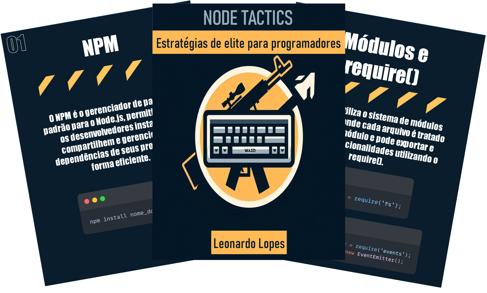

    

-------

# Projeto EBOOK Gerado por I.A.s

 > ℹ️ **NOTE:** Este é o repositório desenvolvido durante o curso no qual fui instrutor técnico na plataforma da [DIO](https://dio.me)

Projeto com o objetivo de gerar um ebook digital com as facilidades das ferramentas de IA. todos os prompts
seguem abaixo.

<a href="https://github.com/do-Lopes/ebook-Soldiers-Backend-with-Machine-Learning/blob/main/output/ebook.pdf" title="View PDF now"> 📕Clique aqui para ler</a>

## 💻 Tecnologias utilizadas no projeto

- [ChatGPT](https://chat.openai.com/) 
- [MidJourney](https://www.midjourney.com/app/)
- [PowerPoint](https://www.microsoft.com/en/microsoft-365/powerpoint)

## 🧠 Prompts

ChatGPT：

|   Ação   | prompt                                                                                                                                                                                                                                                                         |
| :------: | ------------------------------------------------------------------------------------------------------------------------------------------------------------------------------------------------------------------------------------------------------------------------------ |
|  título  | Crie um titulo de um ebook sobre o tema de Node, o ebook é do nicho de programção e o subnicho é de Node, o titulo deve ser curto e épico, e tenha uma temática de jogos modernos como Rainbow six, CS:GO e VALORANT no titulo, me liste 10 variações de titulos                                                        |
| conteúdo | faça um ebook, com foco em node, listando as principais funções |

Midjourney：

|  Ação  | prompt                                                                                 |
| :----: | -------------------------------------------------------------------------------------- |
| título | A CS:GO like logo but switch the weapons with keyboards --v 5.1 |

## ✨ Features

- Conteúdo gerado via ChatGPT
- Imagens geradas via MidJourney

## 📚 Materiais

- Imagens utilizadas em `assets`
- ebook gerado durante as aulas em `output`

## 🛠️ Instruções de execução

Utilize os prompts acima nas ferramentas sugeridas para gerar o material base e utilize uma ferramenta de edição de documentos como power point, libreoffice , indesign para diagramação.

## 👨‍💻 Desenvolvedor

    
    
&nbsp&nbsp&nbspLeonardo Lopes 
    &nbsp&nbsp&nbsp
    <a href="https://www.github.com/do-Lopes">
    GitHub</a>&nbsp;|&nbsp;
    <a href="https://www.linkedin.com/in/
leonardo-lopes-8a38a3215/">LinkedIn</a>
&nbsp;|

